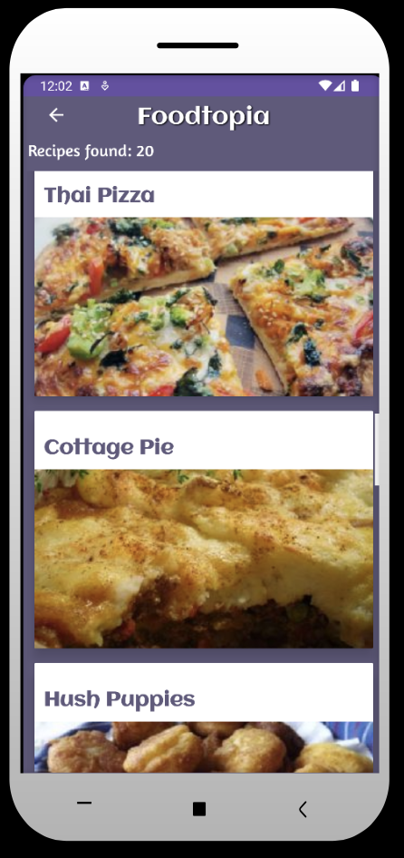
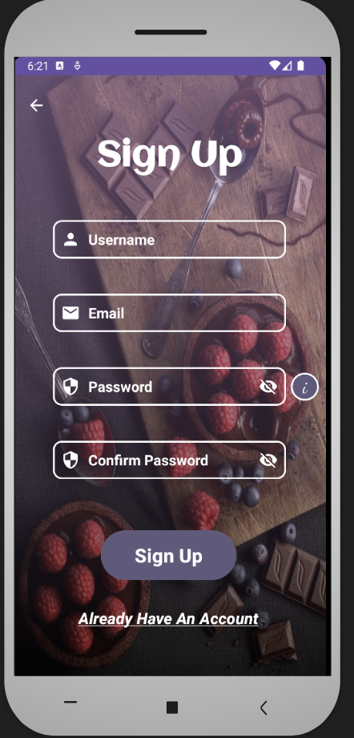
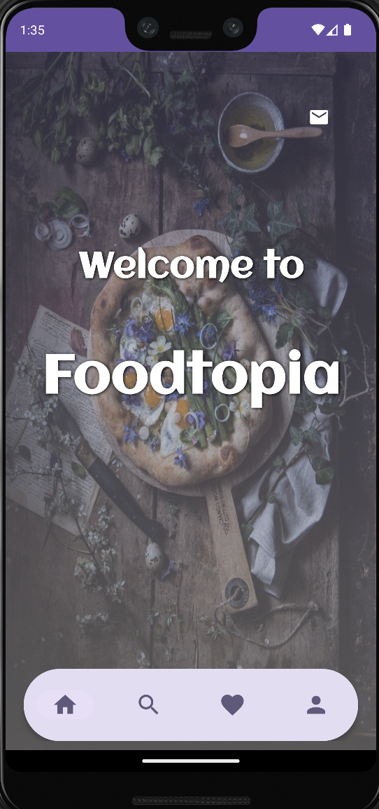

# Foodtopia - A Food Recipes Application

## Team Members

* Sara Hoxha
* Endi Triço
* Sexhi Picaku

## Project Description

For the Mobile Application Development course, we decided to develop a food recipes application. With our app, named "Foodtopia", users can either opt to log in or continue in guest mode so as to access a vast collection of delicious recipes from different cuisines all around the world.

Inside our app, we have incorporated a search function that allows users to easily browse through hundreds of recipes simply by entering a keyword. Moreover, the "Foodtopia" app also allows users to like their favorite recipes, making it easy to save and revisit them later, in their own dedicated "Favorites" page.

Overall, thanks to its user-friendly interface and extensive recipe collection, our food recipes app is a must-have for anyone who loves to cook and experiment with new flavors, all through the convenience of their own mobile phone.

## Tasks implemented

### Activities

Delving into more detail, we have created multi-activities that allow users to perform various actions inside the "Foodtopia" application. These are those activities:

#### Initial Activity
##### _Author: Sara Hoxha_

When the user first launches the application, he is shown an activity that allows the user to opt for authentication or to continue using our application in Guest Mode. This choice is facilitated through the use of Buttons. If the user clicks on the "Log in" button, he is redirected to the Login Activity. Alternatively, if the user clicks on the "Guest Mode" button, he is directly redirected to the Search Recipes Activity.This redirection is done through the use of explicit intents.

#### Login Activity
##### _Author: Sara Hoxha_

After being redirected to the Login Activity, the user will be prompted to enter their email and password. After finishing entering their credentials, the user can try to authenticate and enter the application by clicking on the button "Log In". Firstly, after the user has clicked this button, we check if the user has provided an email and password, and if the email is in valid format. If these conditions are not fulfilled, we display an error message to the appropriate TextView and require the user to amend this data. If this data is entered and in valid format, we check these credentials checked against the data stored in our SQLite database. The process of authentication works by querying the database to see if the entered email and password exists in our database. If a match is found, the user is authenticated and they are redirected to the "Search Activity", through the use of an explicit intent that also sends the authenticated user ID as part of the message. On the other hand, if there is not a match found, the application will display an error toast message indicating that the login failed due to invalid data.

Furthermore, we also have the option for the user to register if they haven't already. This is done by clicking on the "Sign Up Now" label, which redirects them to the Sign Up Activity.

#### Recipe Details Activity
##### _Author: Endi Triço_

It is an activity class named `RecipeDetailsActivity`. The purpose of this activity is to show the details of the selected recipe by introducing the summary, instructions, ingredients, and equipments that will be needed to cook this delicious foods.

The activity extends `AppCompatActivity` to create an activity. Various views such as TextView, ImageView, and RecyclerView are declared as class variables to be used later.

The `onCreate` method is overridden and is called when the activity is created. In the `onCreate` method, the layout for the activity is set using setContentView. The views are initialized using the findViewById method. The id value is retrieved from the intent extras, which represents the ID of the recipe. An instance of APIRequestManager is created to make API requests.

The `getRecipeDetails` method of `APIRequestManager` is called to fetch the recipe details using the `recipeDetailsListener`.
The `getInstructions` method of `APIRequestManager` is called to fetch the recipe instructions using the `instructionsListener`.

A progress dialog is shown to indicate that the details are being loaded.
The `findViews` method is defined to initialize the views.

The `recipeDetailsListener` is implemented as an anonymous class to handle the recipe details response. In the didFetch method of `recipeDetailsListener`, the retrieved recipe details are displayed in the corresponding views.

The `recycler_meal_ingredients` is set up with a horizontal layout manager, and an instance of `IngredientsAdapter` is created and set on the recycler view.

The `instructionsListener` is implemented as an anonymous class to handle the recipe instructions response. In the didFetch method of instructionsListener, the retrieved instructions are displayed in the `recycler_meal_instructions` using an instance of `InstructionsAdapter`.

The `goBackToSearchActivity` method is defined, which is called when the user clicks the back button. It starts the `RecipeSearchResultActivity` and passes the recipe ID as an extra.

This activity fetches and displays recipe details and instructions, and provides navigation to go back to the search activity.

#### Recipe Search Result Activity
##### _Author: Sara Hoxha_

The `RecipeSearchResultActivity` is used to display the search results of recipes, based on the keyword provided by the user.

Inside this activity, we have initialized a `ProgressDialog` to show a loading spinner while the search results are being fetched.

We also initialize an instance of the `APIRequestManager` class with a search keyword, that we get from the "Search Recipe" Activity and we call its `getRecipesSearchResults()` method to fetch the search results from the API.

After the results are fetched, the spinner is dismissed and the results are displayed in a `RecyclerView` using the `RecipeSearchResultAdapter` class to provide the adapter for the recycler view.

The `goBackToSearchPage()` method is called when the user clicks the "Back" button on the activity. This uses an explicit intent to navigate the user back to the "Search Recipe" activity.

####  SignUpActivity
##### _Author: Endi Triço_

The `SignUpActivity` extends `AppCompatActivity` to create an activity. EditText fields for username, email, password, and confirmPassword are declared as class variables. Drawable resources for visibility icons (on and off) and a security icon are initialized.

In the `onCreate` method, the layout for the activity is set using setContentView. The EditText fields and touch listeners are initialized.

The `toggleConfirmPasswordVisibility` method is defined to handle the visibility toggle for the confirm password field.
The `togglePasswordVisibility` method is defined to handle the visibility toggle for the password field.

The `clickSignUpButton` method is called when the user clicks the sign-up button.
It validates the input fields and adds the user to the database if the input is valid. If the user is added successfully, the input fields are cleared, and a success message is displayed.

The `clickAlreadyHaveAnAccount` method is called when the user clicks the "Already have an account" button. It navigates to the login activity.

The `validateEmail`, `validateUsername`, `validatePassword`, and `validateConfirmPassword` methods are defined to validate the input fields. These methods check if the input fields meet the required criteria and display error messages if they don't. The `confirmInput` method is called to validate all input fields at once.

The `passwordInformation` method is called when the user clicks the "Password Information" button.  It displays a toast message with information about the password requirements.

The `goBackToInitialActivity` method is called when the user clicks the back button.  It navigates back to the initial activity.

`SignUpActivity` allows users to sign up by entering their username, email, password, and confirming the password. It provides input validation and database interaction to add the user to the system.

####  WelcomeActivity
##### _Author: Endi Triço_

The `WelcomeActivity` extends `AppCompatActivity` to create an activity. In the `onCreate` method, the layout for the activity is set using setContentView.

The `emailTo` method is called when the user clicks the email button. It creates an intent with the action Intent.ACTION_SENDTO to compose an email. The email address "info@foodtopia.al" is set as the recipient in the intent. The intent is started using startActivity to open the email client with the recipient pre-filled.

This activity sets up the welcome screen of the application and displays the BottomNavigationFragment. It also provides the functionality to compose an email to the specified email address when the user clicks the email button.

####  Search Activity
##### _Author: Sexhi Picaku_

The `SearchActivity` is used to search the recipe that the user wants . So,the user after writing the name of recipe and pressing enter ,below the app will show the results of the search. Also the user can write just one part of the name of recipe and the results will shown all the recipes related with that part of the search. Going in details:

1.The `SearchActivity`  class is defined and it extends the `AppCompatActivity`  class, which is the base class for activities that use the support library action bar features.

2.Inside the ` SearchActivity`  class, there are several member variables declared: 
`progressDialog` ;This variable represents a progress dialog, which is used to show a loading indicator while performing a search.
`searchView` : This variable represents a search view, which allows the user to enter a search query.
`searchText` : This variable stores the text entered by the user in the search view.

3.The `onCreate`   method is overridden. This method is called when the activity is being created.
The layout file `activity_search.sol`  is set as the content view for the activity using the `setContentView`  method.
A progress dialog is initialized and configured with a title. 
The `SharedPreferences`  object is used to retrieve the login state of the user. If the user is logged in (isLoggedIn is true), the selected item ID is obtained from the intent extras.
An instance of the `BottoNavigationEragment` class is created and arguments are passed to it using a bundle.
The fragment is replaced in the container with the ID `fragmentContainerSearchNav`  using a Fragment Transaction.  
If the user is not logged in, the bottom navigation bar fragment is removed from the container.
The `searchiView`  is initialized and configured. Event listeners are set on the `searchView`  to handle query submission and text changes.

4.The `submitAndGoToRecipesearchResult`  method is called when the user clicks a button to submit the search query.
 If the search text is empty, a toast message is shown to prompt the user to enter something in the search bar.
 If the search text is not empty, an intent is created to start the `RecipesearchResultActivity`  class. 
 The search text is added as an extra to the intent. The `startActivity`  method is called to navigate to the search result activity.

5.The `goBackToInitialActivity`  method is called when the user clicks a button to go back to the initial activity (presumably the login activity). 
An intent is created to start the `LoginActivity`  class.
The `startActivity`  method is called to navigate to the login activity.

####  Favorite Activity
##### _Author: Sexhi Picaku_

Favorite Activity shows all the favorite recipes of the user by clicking the heart in the recipe that user wants. The heart from white color ,will be red by clicking it. In this way those recipes will go automatically at favorites interface. Also the user can make unclick by removing the recipe  from favorites.Each user will have their own favorites recipes.

`MyDatabaseHelper(this)`- It creates a new instance of the `MyDatabaseHelper` class, which handles the database operations for managing recipes.

`setContentView(R.layout.fav_fragment_recycler)`- It sets the layout file fav_fragment_recycler.xml as the content view for the activity or fragment. This layout contains the `RecyclerView` and other necessary views.

`findViewById(R.id.fav_recyclerView)` - It finds the RecyclerView with the id fav_recyclerView from the layout.

`recyclerView.setAdapter(new FavoriteAdapter(this, helper.getAllRecipes()` - It sets the adapter for the `RecyclerView`. The adapter used is an instance of the `FavoriteAdapter` class provides the current context (activity or fragment) to the adapter.

`helper.getAllRecipes()`- It retrieves all the recipes from the database using the ‘getAllRecipes()’ method of the ‘MyDatabaseHelper class’

new `RecipeClickListener()`- It creates an instance of the ‘RecipeClickListener’ interface, which is a callback for recipe click events. 

In Favorite Adapter;

`if(helper.isRecipeExists(recipe.id))`- It checks if the current recipe is already saved as a favorite in the database by calling the `isRecipeExists()` method of the `MyDatabaseHelper` class.

If the recipe exists in the database:
`holder.imgFvrt.setImageTintList(ColorStateList.valueOf(Color.RED))` - It sets the tint color of the favorite icon to red, indicating that the recipe is a favorite.

If the recipe does not exist in the database:
`holder.imgFvrt.setImageTintList(ColorStateList.valueOf(Color.WHITE))`-  It sets the tint color of the favorite icon to white, indicating that the recipe is not a favorite.

`holder.imgFvrt.setOnClickListener(new View.OnClickListener()` - It sets a click listener on the favorite icon. When the icon is clicked:

If the recipe exists in the database:
`helper.deleteRecipe(recipe.id)`It deletes the recipe from the database using the deleteRecipe() method of the `MyDatabaseHelper` class.

`recipeList.remove(holder.getAbsoluteAdapterPosition())` - It removes the recipe from the list of recipes in the adapter.

`notifyItemRemoved(holder.getAbsoluteAdapterPosition())`- It notifies the adapter that an item has been removed at the specified position, triggering a UI update.

If the recipe does not exist in the database:
`helper.saveRecipe(recipe)`- It saves the recipe to the database using the saveRecipe() method of the `MyDatabaseHelper` class.

`holder.imgFvrt.setImageTintList(ColorStateList.valueOf(Color.RED))` - It sets the tint color of the favorite icon to red, indicating that the recipe is now a favorite.

####  Profile Activity
##### _Author: Sexhi Picaku_

Clicking profile icon in the navigation bar will directed to Profile Activity. 
Profile Activity shows username, email and password that the user will fullfill.
Also in this activity the user can log out and update all the information that he/she wants. 

The imports at the beginning of the code include necessary Android classes and the`MyDatabaseHelper` class, which is a custom database helper class for managing user data.
  
The `ProfileActivity` class is declared as a subclass of `AppCompatActivity`, which is the base class for activities that use the support library action bar features.
 
Various variables and views are declared, including `usernameTextView`, `emailTextView`, and `passwordTextView` representing the `EditText` views for username, email, and password input respectively.
  
  In the onCreate method, the activity layout is set using setContentView. Then, the database helper object is created.
    
Various click listeners and touch listeners are set on views to handle user interactions. For example, the `togglePasswordVisibility` method is called when the password visibility icon is clicked to show or hide the password.

An instance of the `BottomNavigationFragment` class is created and added to the activity's layout using fragment transactions.
Click listeners are set on buttons to handle actions such as updating user information or logging out.
   
The `getUserData` method is called on the database helper object to retrieve the current user's data based on the currentEmail value. The retrieved data is then populated into the corresponding EditText views.
    
The `clickUsernamePencil`, `clickEmailPencil`, and `clickPasswordPencil` methods are called when the user clicks on the pencil icons next to the username, email, and password fields respectively. These methods toggle the editability of the corresponding `EditText` views.
 
 The `togglePasswordVisibility` method is responsible for toggling the visibility of the password text in the password `EditText` view
 
 
 Several methods in a custom database helper class that handle updating user information in an SQLite database. 
 
1. `public boolean updateUser(String id, String username, String email, String password)`: This method updates the user's username, email, and password in the database. It takes the user's ID, new username, new email, and new password as parameters. It first gets a writable database instance using `getWritableDatabase()`. Then, it creates a `ContentValues` object and puts the new values for username, email, and password into it. The method then executes a query to check if a user with the given ID exists in the database. If the user exists, it performs an update operation on the "Users" table using the new values and the user's ID. Finally, it returns true if the update was successful, and false otherwise.

2. `public boolean updateUsername(String id, String username)`: This method updates the user's username in the database. It takes the user's ID and new username as parameters. It follows a similar approach to the updateUser method but only updates the username field in the "Users" table.
 
3. `public boolean updateEmail(String id, String email)`: This method updates the user's email in the database. It takes the user's ID and new email as parameters. It follows a similar approach to the updateUser method but only updates the email field in the "Users" table.

4. `public boolean updatePassword(String id, String password)`: This method updates the user's password in the database. It takes the user's ID and new password as parameters. It follows a similar approach to the updateUser method but only updates the password field in the "Users" table.

5. `public boolean isEmailAlreadyExists(String email)`: This method checks if an email already exists in the database. It takes an email as a parameter and uses `getReadableDatabase()` to get a readable database instance. Then, it performs a query on the "users" table to check if any rows have the given email. If the cursor returns any rows, it means that the email already exists, and the method returns true. Otherwise, it returns false.

### Adapters

#### IngredientsAdapter
##### _Author: Endi Triço_

`IngredientsAdapter` is responsible for binding data to the views in each item of the RecyclerView.

The `IngredientsAdapter` class extends `RecyclerView.Adapter<IngredientsViewHolder>` and takes a context and a list of `ExtendedIngredient` objects as parameters in its constructor.

The `onCreateViewHolder` method is overridden to inflate the layout for each item of the `RecyclerView`. It inflates the `list_meal_ingredients` layout using the LayoutInflater and returns an instance of `IngredientsViewHolder` that holds the inflated views.

The `onBindViewHolder` method is overridden to bind the data to the views in each item. It gets the current `ExtendedIngredient` object from the list based on the current position and sets the appropriate data to the views in the `IngredientsViewHolder`.

The `getItemCount` method returns the number of items in the list, which determines the number of items in the `RecyclerView`.

The `IngredientsViewHolder` class is a ViewHolder that holds the views for each item in the `RecyclerView`. It initializes the views (e.g., textView_ingredients_quantity, textView_ingredients_name, imageView_ingredients) in its constructor.

This adapter class is used to populate a `RecyclerView` with a list of `ExtendedIngredient` objects, setting the appropriate data to each view in the item layout (`list_meal_ingredients`). It uses `Picasso` library to load images into the imageView_ingredients using the URL provided in the `ExtendedIngredient` object.

#### InstructionsAdapter
##### _Author: Endi Triço_

The `InstructionsAdapter` is responsible for binding data to the views in each item of the RecyclerView.

The `InstructionsAdapter` class extends `RecyclerView.Adapter<InstructionsViewHolder>` and takes a context and a list of `InstructionsResponse` objects as parameters in its constructor.#

The `onCreateViewHolder` method is overridden to inflate the layout for each item of the `RecyclerView`. It inflates the `list_instructions` layout using the LayoutInflater and returns an instance of `InstructionsViewHolder` that holds the inflated views.

The `onBindViewHolder` method is overridden to bind the data to the views in each item. It gets the current `InstructionsResponse` object from the list based on the current position. It sets up a LinearLayoutManager for the recycler_instruction_steps `RecyclerView`, and creates an instance of `InstructionStepAdapter` to populate the steps in the `RecyclerView`.

The `getItemCount` method returns the number of items in the list, which determines the number of items in the `RecyclerView`.

The `InstructionsViewHolder` class is a ViewHolder that holds the views for each item in the `RecyclerView`. It initializes the views (e.g., recycler_instruction_steps) in its constructor.

This adapter class is used to populate a `RecyclerView` with a list of `InstructionsResponse` objects. It sets up a nested `RecyclerView` (recycler_instruction_steps) for each item and uses the `InstructionStepAdapter` to populate the steps in the nested `RecyclerView`.

#### InstructionsEquipmentsAdapter
##### _Author: Endi Triço_

The `InstructionsEquipmentsAdapter` is responsible for binding data to the views in each item of the `RecyclerView`.

The `InstructionsEquipmentsAdapter` class extends `RecyclerView.Adapter<InstructionsEquipmentsViewHolder>` and takes a context and a list of `Equipment` objects as parameters in its constructor.

The `onCreateViewHolder` method is overridden to inflate the layout for each item of the `RecyclerView`. It inflates the `list_instructions_step_items` layout using the LayoutInflater and returns an instance of `InstructionsEquipmentsViewHolder` that holds the inflated views.

The `onBindViewHolder` method is overridden to bind the data to the views in each item. It gets the current `Equipment` object from the list based on the current position and sets the appropriate data to the views in the `InstructionsEquipmentsViewHolder`.

The `getItemCount` method returns the number of items in the list, which determines the number of items in the `RecyclerView`.

The `InstructionsEquipmentsViewHolder` class is a ViewHolder that holds the views for each item in the `RecyclerView`. It initializes the views (e.g., imageView_instructions_step_items, textView_instructions_step_item, textView_equipments) in its constructor.

This adapter class is used to populate a `RecyclerView` with a list of `Equipment` objects. It sets the appropriate data to each view in the item layout (`list_instructions_step_items`) using the `Equipment` object. It also uses `Picasso` library to load images into the imageView_instructions_step_items using the URL provided in the `Equipment` object.

#### InstructionsIngredientsAdapter
##### _Author: Endi Triço_

The `InstructionsIngredientsAdapter` is responsible for binding data to the views in each item of the `RecyclerView`.

The `InstructionsIngredientsAdapter` class extends `RecyclerView.Adapter<InstructionsIngredientsViewHolder>` and takes a context and a list of `Ingredient` objects as parameters in its constructor.

The `onCreateViewHolder` method is overridden to inflate the layout for each item of the `RecyclerView`. It inflates the `list_instructions_step_items` layout using the LayoutInflater and returns an instance of `InstructionsIngredientsViewHolder` that holds the inflated views.

The `onBindViewHolder` method is overridden to bind the data to the views in each item. It gets the current `Ingredient` object from the list based on the current position and sets the appropriate data to the views in the `InstructionsIngredientsViewHolder`.

The `getItemCount` method returns the number of items in the list, which determines the number of items in the `RecyclerView`.

The `InstructionsIngredientsViewHolder` class is a ViewHolder that holds the views for each item in the `RecyclerView`. It initializes the views (e.g., imageView_instructions_step_items, textView_instructions_step_item, textView_ingredients) in its constructor.

This adapter class is used to populate a `RecyclerView` with a list of `Ingredient` objects. It sets the appropriate data to each view in the item layout (`list_instructions_step_items`) using the `Ingredient` object. It also uses `Picasso` library to load images into the imageView_instructions_step_items using the URL provided in the `Ingredient` object.

#### InstructionStepAdapter
##### _Author: Endi Triço_

The `InstructionStepAdapter` is responsible for binding data to the views in each item of the `RecyclerView`.

The `InstructionStepAdapter` class extends `RecyclerView.Adapter<InstructionStepViewHolder>` and takes a context and a list of `Step` objects as parameters in its constructor.

The `onCreateViewHolder` method is overridden to inflate the layout for each item of the `RecyclerView`. It inflates the `list_instructions_steps` layout using the LayoutInflater and returns an instance of `InstructionStepViewHolder` that holds the inflated views.

The `onBindViewHolder` method is overridden to bind the data to the views in each item. It gets the current `Step` object from the list based on the current position and sets the appropriate data to the views in the `InstructionStepViewHolder`. In the `onBindViewHolder` method, it sets the step number and title to the respective TextViews. It initializes and sets up a horizontal `RecyclerView` (recycler_instructions_ingredients) for displaying the list of ingredients for each step. It creates an instance of `InstructionsIngredientsAdapter` and sets it as the adapter for the RecyclerView. If the list of ingredients is empty, it hides the LinearLayout_Ingredients layout. It also initializes and sets up a horizontal `RecyclerView` (recycler_instructions_equipments) for displaying the list of equipment for each step. It creates an instance of `InstructionsEquipmentsAdapter` and sets it as the adapter for the RecyclerView. If the list of equipment is empty, it hides the LinearLayout_Equipments layout.

The `getItemCount` method returns the number of items in the list, which determines the number of items in the `RecyclerView`.

The `InstructionStepViewHolder` class is a ViewHolder that holds the views for each item in the `RecyclerView`. It initializes the views (e.g., textView_instructions_step_number, textView_instructions_step_title, recycler_instructions_equipments, recycler_instructions_ingredients) in its constructor. It also initializes the views for the equipment and ingredients headers (textView_equipments, textView_ingredients) and the layout containers (LinearLayout_Equipments, LinearLayout_Ingredients).

This adapter class is used to populate a `RecyclerView` with a list of Step objects. It sets the appropriate data to each view in the item layout (`list_instructions_steps`) using the `Step` object. It also sets up additional RecyclerViews for displaying ingredients and equipment if they exist, and hides the respective layouts if the lists are empty.

#### RecipeSearchResultAdapter
##### _Author: Sara Hoxha_

The `RecipeSearchResultAdapter` class is used to display a list of recipes obtained from the Spoonacular API call.

The `RecipeSearchResultAdapter` class extends the `RecyclerView.Adapter` class and has a constructor that takes two parameters, a `Context` object, and a list of `Recipe` objects.

The `onCreateViewHolder()` method creates a new instance of the `RecipeSearchResultViewHolder` class, which contains a `CardView` that displays the recipe information. 

The `getItemCount()` method returns the number of recipes in the list.

The `onBindViewHolder()` method binds the data from the `Recipe` object to the `RecipeSearchResultViewHolder`.

The `RecipeSearchResultViewHolder` class is an inner class that extends `RecyclerView.ViewHolder`. It has a constructor that takes a View object and initializes the card view, the dish name, and the dish image that will be displayed in the layout.

### Database

#### MyDatabaseHelper
##### _Author: Endi Triço, Sara Hoxha, Sexhi Picaku_

The `MyDatabaseHelper` class extends `SQLiteOpenHelper` and takes the context as a parameter in its constructor. It also defines the database name (DATABASE_NAME) and version (DATABASE_VERSION).

The `onCreate` method is overridden, and it is called when the database is created for the first time. It executes an SQL query to create the "Users" table with columns for ID, username, email, and password.

The `onUpgrade` method is overridden, and it is called when the database needs to be upgraded. In this case, it drops the existing "Users" table and calls the onCreate method to recreate it.

The `addUser` method is used to insert a new user into the "Users" table. It first checks if the email already exists in the table by performing a query. If the email exists, it returns false indicating that the user was not added. If the email does not exist, it creates a ContentValues object to store the user's data and inserts it into the table using the insertOrThrow method. It returns true indicating that the user was successfully added.

The `readAllData` method retrieves all the data from the "Users" table and returns a Cursor object containing the result.

The `getUserData` method retrieves the data of a specific user based on their email. It performs a query with a selection and selectionArgs to filter the result and returns a Cursor object containing the user's data.

This `MyDatabaseHelper` class provides methods to create the database, insert new users, retrieve user data, and delete users from the "Users" table in the SQLite database.

### Classes

#### APIRequestManager
##### _Author: Sara Hoxha & Endi Triço_

To make API requests to retrieve recipe information from the Spoonacular API, we have implemented the `APIRequestManager` class. The class contains two constructors, one for searching recipes by name and another for searching recipes information by recipes ID. Moreover, the class utilizes Retrofit library to handle network requests and responses.

Inside this class, we have defined the `searchRecipes` interface, which defines a method that makes a GET request to the Spoonacular API, namely the Search Recipes function, to search for recipes based on three parameters:
* query ->  specifies the keyword that will be used to search for recipes
* number -> specifies the maximum number of results returned
* apiKey -> specifies the unique API Key used to make the request

Another interface defined in the class is the `CallRecipeDetails` interface, which defines a method that makes a GET request to the Spoonacular API, namely the Get Recipe Information function, to retrieve recipe information for a specific recipe based on two parameters:
* id -> recipe ID
* apiKey -> specifies the unique API Key used to make the request

Another interface defined in the class is the `CallInstructions` interface, which defines a method that makes a GET request to the Spoonacular API, namely the Get Recipe Analyzed Instructions, to retrieve recipe analyzed information for a specific recipe based on two parameters:
* id -> recipe ID
* apiKey -> specifies the unique API Key used to make the request

CallInstructions

The `getRecipesSearchResults` method sends a search query to the API to retrieve a list of recipes matching the provided recipe name. It calls the `searchRecipes` interface and enqueues a Retrofit `Call` object for asynchronous execution. It handles the response and notifies the listener accordingly.
The `getRecipeDetails` method retrieves detailed information about a specific recipe by its ID. It calls the `CallRecipeDetails` interface and enqueues a Retrofit `Call` object. It also handles the response and notifies the listener.
The `getInstructions` method fetches the step-by-step instructions for a recipe by its ID. It calls the `CallInstructions` interface and enqueues a Retrofit `Call` object. It handles the response and notifies the listener.

### Fragment
#### BottomNavigationFragment
##### _Author: Endi Triço_

This a fragment class that represents a bottom navigation bar in an Android application.

The `BottomNavigationFragment` class extends the `Fragment` class to create a fragment.
In the `onCreateView` method, the layout for the fragment is inflated using the provided inflater and container. The layout file used is `fragment_bottom_navigation.xml`.

The `BottomNavigationView` is retrieved from the inflated layout using its ID. A listener is set on the `BottomNavigationView` using the `setOnItemSelectedListener` method. Inside the listener, the selected item ID is checked to determine which menu item was clicked.
If the "Home" menu item is clicked (R.id.menu_home), it starts the `WelcomeActivity`.
If the "Search" menu item is clicked (R.id.menu_search), it starts the `SearchActivity`.
If the "Favorites" menu item is clicked (R.id.menu_favorites), it starts the '`avoritesActivity`.
If the "Profile" menu item is clicked (R.id.menu_profile), it starts the `ProfileActivity`.
The method returns the inflated view.

This code sets up the bottom navigation bar in the fragment and handles the item selection to start the corresponding activities based on the selected menu item.

### Listeners

#### APISearchResponseListener
##### _Author: Sara Hoxha_

The `APISearchResponseListener` is an interface that defines two methods that must be implemented by any class that wants to listen for and handle the response of an API request made to retrieve recipes from the Spoonacular API.

The didFetch method is called when the API request is successful and the response contains the information for the requested recipe. This method takes in the APISearchResponse object as a parameter, which contains the recipe information, and a message string that describes the status of the response.

The didError method is called when there is an error in the API request and the response is not successful. This method takes in a message string that describes the error that occurred.

#### InstructionsListener
##### _Author: Endi Triço_

The `Instructions Listener` is an interface that defines two methods that must be implemented by any class that wants to listen for and handle the response of an API request to get the instructions that the user needs to follow to cook their delicious recipe by using the Spoonacular API.

The `didFetch` method is called when the API request is successful and the response contains the information for the requested instructions' recipe. This method takes in a List of InstructionsResponse objects as a parameter, which contains the instructions information, and a message string that describes the status of the response.

The `didError` method is called when there is an error in the API request and the response is not successful. This method takes in a message string that describes the error that occurred.

#### RecipeClickListener
##### _Author: Endi Triço_

The `RecipeClickListener` is an interface that defines only one method that must be implemented by any class that wants to listen for and handle the response of an API request to get the detailed information by using the click event.

This interface defines only one method named `onRecipeClicked` that takes as parameter the id of the recipe of type String, which corresponds to the image or name of the food that the user will click on.

#### RecipeDetailsListener
##### _Author: Endi Triço_

The `RecipeDetailsListener` is an interface that defines two methods that must be implemented by any class that wants to listen for and handle the response of an API request to retrieve a detailed information regarding a specific recipe using Spoonacular API.

The didFetch method is called when the API request is successful and the response contains the information for the requested recipe. This method takes in the `RecipeDetailsListener` object as a parameter, which contains the recipe information, and a message string that describes the status of the response.

The `didError` method is called when there is an error in the API request and the response is not successful. This method takes in a message string that describes the error that occurred.

## External Resources
To provide a way for the "Foodtopia" application to access and retrieve data about various food recipes, ingredients, and nutritional information, we have used the Spoonacular Food API. Through using two API functions, namely Search Recipes and Get Recipe Information, we were able to offer a vast array of recipes that are updated regularly and provide our users with accurate information about ingredients, measurements, and nutritional values for their chosen recipes.

**Spoonacular Food API** - https://spoonacular.com/food-api

To simplify the process of making network requests and handling APIs in our Android application, we have utilized the popular open-source library Retrofit.
**Retrofit** - https://github.com/square/retrofit

To simplify the process of loading and displaying images in our Android application, we have utilized the popular open-source library Picasso.
**Picasso** - https://github.com/square/picasso
